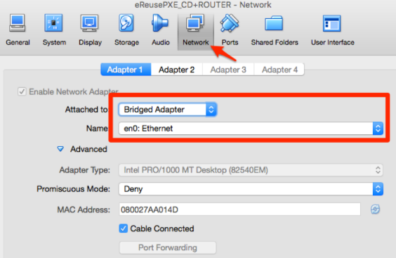

# eReuse: How to use our (PXE) server

This server allow us to register easily and very fast by sending DeviceInventory to all PC 
connected on the LAN network.

#### To register we need the following

- A PC with:
  - [VirtualBox](https://www.virtualbox.org/wiki/Downloads)
  - [eReusePXE_CD-ROUTER.ova](https://github.com/eReuse/device-inventory/releases/latest)
  - [eReuseOS_vX.iso](https://github.com/eReuse/device-inventory/releases/latest)
  - Some Ubuntu-derived installation ISO to optionally install in computers, [lubuntu-X.iso](http://cdimage.ubuntu.com/lubuntu/releases/16.04.1/release/)
- Switch
- Network cables
- PC to register

####Steps to install and setup the server:
1. Disconnect any router (any DHCP provider in general) from the network. Just use the switch or hub.
2. Install VirtualBox on any Win/Linux/Mac computer. We will call this computer as the *host*.
2. Double click on `eReusePXE_CD.ova` to import the server on VirtualBox.
3. Check the network configuration on VirtualBox.
  1. Adapter 1 should be on Ethernet (cable) interface with others computer (to be registed): 
  2. Adapter 2 should be on NAT if you have a second ethernet slot or WiFi adapter.
4. Insert [DeviceInventory](https://github.com/eReuse/device-inventory/releases/latest) (download it from Downloads section, at the bottom) as first CD media: 
5. Insert Ubuntu ISO as second CD media: 
6. Run the virtual server and wait until it asks for *login*. There is no need for login. Now you [can start registering your computers](#register-a-computer), or [configure the server to automate tasks](#configure-iso-options)

####Register a computer
1. Connect a PC on the LAN network.
2. Configure the BIOS (the first few seconds when computer starts) to boot first from LAN:
  1. Maybe there is an option to automatically boot from the network. 
    - Watch for the BIOS Setup Message. 
    - Press F12, F8 or F9 to enter on boot menu selection.
  2. Enter to Setup and change the boot priority.
    - Watch for the BIOS Setup Message.
    - Press F2 or F10 to enter on BIOS menu.
3. When the computer starts on LAN it will load the image from the server (it can take some time).
4. Follow [this guide about the inventory process](https://github.com/eReuse/device-inventory/blob/master/docs/USB_Register.md#4-inventory-process-register-hardware-characteristics-of-a-computer)
5. The file will be automatically uploaded to the PXE Server, but you can still copy it too to a USB memory stick.

The generated files of all computers will be stored in a public folder in the PXE Server. To access the folder write, on the host machine, `\\192.168.2.2\` in Windows Explorer, or `smb://192.168.2.2/` in a Linux console or after pressing <kbd>⌘</kbd><kbd>K</kbd> in Mac's Finder, and access as the public user (which can be called guest, public or anonymous).

####Install a computer
After registering the computer, you may want to perform an installation from the Ubuntu ISO that you attached to the server. To do it, reboot the computer (with Ctrl+Alt+Supr or by running ``sudo reboot``) and ensure that it boots again via PXE (see the previous section). As soon as the ``boot:`` prompt appears, be quick to hit Tab to see the boot options. Besides the ``eReuse`` option (which is used to run the computer registration, as explained before), you should be able to enter ``Ubuntu`` and boot the installer.

####Configure ISO options
You can automatize tasks of DeviceInventory by modifying the configuration file ([config.ini](https://raw.githubusercontent.com/eReuse/device-inventory/master/device_inventory/config.ini)). For example, you can set to always erase disks in a specific way, so the system will not ask the user about this, avoiding spending time and user errors. To modify the configuration file on the server, do the following:

1. On the server machine from VirtualBox, login with the credentials (username: ereuse, password: ereuse).
2. write in the terminal `nano /home/ereuse/config.ini`
3. Enable or disable all the options that you want.
4. Save the changes pressing <kbd>Ctrl</kbd><kbd>O</kbd> and enter. Exit with <kbd>Ctrl</kbd><kbd>X</kbd>.

####Server info: 
- User: ereuse 
- Password: ereuse 
- IP of eReuse server: 192.168.2.2 
- Shared folder: 
  - Windows: `\\192.168.2.2\`
  - Linux: `smb://192.168.2.2/`

There is two network interfaces on the VirtualBox server.
  - eth0 (adapter 1): On “Bridged Adapter” on ethernet interface connected on the LAN with the other PCs to register.
  - eth1 (adapter 2): On “NAT” to connect on Internet from PC (if you have another interface with Internet like WiFi).
